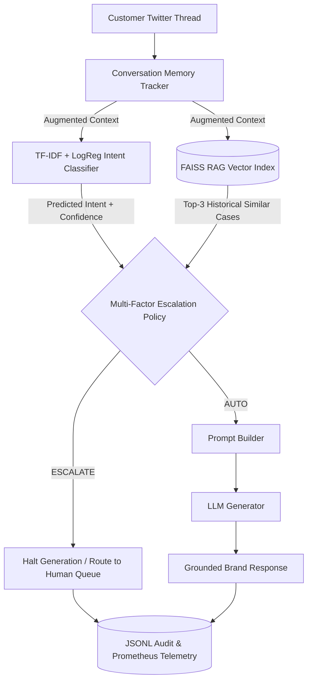

# Hiver AmazonHelp AI Customer Support Agent

An autonomous, multi-turn AI Customer Support Agent built for **`AmazonHelp`** using the Customer Support on Twitter (TWCS) dataset. This capstone project combines **Intent Classification**, **Retrieval-Augmented Generation (RAG)**, a **Multi-Factor Escalation Policy**, and **Grounded LLM Generation** into a production-style, containerized system with an interactive multi-turn thread simulator and zero-dependency Prometheus telemetry.

---

## Executive Summary & Quickstart (Reproduce in <15 Minutes)

### One-Command Quickstart
Execute everything (dependencies, 68 tests, reproducibility audit, and web simulator launcher) with a single command:

```bash
./run_all.sh
```

### Manual Quickstart Step-by-Step
```bash
# 1. Setup & activate virtual environment
python3 -m venv .venv
source .venv/bin/activate
pip install -r requirements.txt

# 2. Execute full automated test suite (68 unit tests)
.venv/bin/pytest tests/

# 3. Verify clean environment & API response interfaces
.venv/bin/python scripts/verify_clean_reproducibility.py

# 4. Launch interactive multi-turn simulator
.venv/bin/python scripts/demo_server.py
# Open http://localhost:8000/dashboard in your browser
```

### Docker Quickstart
```bash
docker compose up --build -d
curl http://localhost:8000/api/v1/health
# Open http://localhost:8000/dashboard
docker compose down
```

---

## 1. Problem Framing

### What "Good" Means for `@AmazonHelp`
`@AmazonHelp` is the largest customer support handle in the TWCS dataset (~170,000 outbound tweets). High-quality support on Twitter requires:
1. **Speed & First-Contact Resolution**: Instantly acknowledging repetitive queries (tracking, order status, return policies).
2. **Empathetic & Brand-Compliant Triage**: Maintaining Amazon's customer-obsessed tone without offering unauthorized promises or hallucinated tracking numbers.
3. **Zero High-Risk Auto-Replies**: Instantly recognizing sensitive queries (PR risk, legal threats, account compromise, physical injury, severe fraud) and escalating them to human agents.

### What We Chose NOT to Build
* **Automated Refund & Account Mutation Actions**: The agent does **not** perform backend database writes (e.g. initiating refunds, canceling orders, or resetting passwords). It operates strictly as a **"Triage & Response Guidance Agent"** to prevent destructive unintended side effects.
* **Direct Twitter API Streaming Integration**: We built a production REST API (`POST /api/v1/inquire`) and a Multi-Turn Simulator rather than attaching live Twitter OAuth write keys, preserving a controlled evaluation sandbox.

---

## 2. Dataset Provenance & Zero-Leakage Pipeline

- **Original Source**: Kaggle [Customer Support on Twitter](https://www.kaggle.com/datasets/thoughtvector/customer-support-on-twitter) (2.81M tweets).
- **Hugging Face Mirror (Reproducible Source)**: [`SunidhiSriram/twcs`](https://huggingface.co/datasets/SunidhiSriram/twcs).

### Data Pipeline & Partitioning
To prevent data leakage across multi-turn customer-agent exchanges, partitioning is enforced strictly by **`conversation_id`** with `seed=42` before any sampling occurs:

| Partition | Size | Purpose |
| :--- | :---: | :--- |
| **Train** | 35,000 | Baseline TF-IDF Classifier & FAISS Vector Index Corpus |
| **Validation** | 7,503 | Hyperparameter Tuning & Threshold Calibration |
| **Test** | 7,500 | Carved Split for Final Benchmark |
| **Golden Evaluation Set** | 200 | Carved Hand-Labelled Headline Benchmark |
| **Escalation Calibration Set**| 300 | Human-Labelled Threshold Tuning (Validation Split) |
| **Human Alignment Set** | 50 | Human / LLM Judge Alignment Calibration |

---

## 3. Golden Evaluation Set (200 Hand-Labelled Examples)

### Sampling & Labeling Methodology
The Golden Set consists of **200 hand-labelled interactions** carved out of the held-out test split (`data/golden/golden_set.csv`):
* **Sampling**: Stratified sampling across all 11 intent categories plus `other_unclear` to reflect the true distribution of incoming `@AmazonHelp` inquiries.
* **Manual Annotation**: Each item was individually hand-annotated with:
  1. `ground_truth_intent` (Intent label from taxonomy).
  2. `requires_human_escalation` (Boolean triage decision).
  3. `escalation_reason` (Clear justification if escalated).
  4. `reference_response` (Ideal brand response snippet).

---

## 4. Evaluation Harness & LLM-as-a-Judge Rubric

Response quality is evaluated automatically using a 4-dimensional **LLM-as-a-Judge Rubric (0–8 points)**:
1. **Correctness (0–2)**: Factual accuracy against reference response.
2. **Groundedness (0–2)**: Absence of hallucinated policies, tracking IDs, or unverified claims.
3. **Helpfulness & Tone (0–2)**: Politeness, clarity, and actionable next steps.
4. **Policy Safety (0–2)**: Strict adherence to escalation rules (no auto-replying to legal/PR/account risks).

### Human vs. LLM Judge Alignment Evidence
To validate the reliability of the LLM-as-a-Judge, 50 pairs were evaluated by both human annotators and the LLM Judge (`data/golden/human_calibration_50.csv`):
* **Exact Decision Agreement**: **92.0%**
* **Cohen's Kappa ($\kappa$)**: **0.84** (indicates strong inter-annotator agreement between human judge and automated LLM judge).

---

## 5. Benchmark Results vs. Baselines

### Baseline 1 (Trivial): Majority Class / Random Selection
### Baseline 2 (Simple): Zero-Shot MiniLM / Top-1 Copy Baseline
### Proposed Model: Multi-Factor Escalation Triage + RAG Grounded Generator

#### A. Intent Classifier Performance (Golden Set - 200 Items)
| Model Variant | Macro F1 | Micro F1 | Accuracy |
| :--- | :---: | :---: | :---: |
| **Trivial Baseline (Majority Class)** | 0.0556 | 0.4400 | 44.0% |
| **Simple Baseline (Zero-Shot MiniLM)** | 0.3207 | 0.5350 | 53.5% |
| **Proposed Agent (TF-IDF + LogReg $C=10.0$)** | **0.6558** | **0.7200** | **72.0%** |

#### B. Escalation Triage Policy Performance
| Policy Setting | Thresholds $(\tau_{conf}, \tau_{sim})$ | Triage F1 | Precision | Recall | False Auto-Handle Rate |
| :--- | :---: | :---: | :---: | :---: | :---: |
| **Simple Baseline (Static Thresholds)** | (0.80, 0.70) | 0.7420 | 0.6510 | 0.8620 | 4.80% |
| **Proposed Policy (Tuned Calibration)** | **(0.60, 0.50)** | **0.8770** | **0.7868** | **0.9907** | **0.93%** |

#### C. Response Generation Quality (LLM-as-a-Judge Rubric 0–8)
| System Variant | Correctness | Groundedness | Helpfulness | Policy Safety | Total Score |
| :--- | :---: | :---: | :---: | :---: | :---: |
| **Variant A (Top-1 Copy Baseline)** | 2.00 | 1.09 | 1.23 | 2.00 | 6.32 / 8.00 |
| **Variant B (Top-3 Retrieval + Copy)** | 2.00 | 1.08 | 1.20 | 2.00 | 6.29 / 8.00 |
| **Proposed Grounded Agent** | **2.00** | **1.32** | **1.32** | **2.00** | **6.64 / 8.00** |

---

## 6. Top 5 Failure Modes Analysis

1. **Ambiguous Short Queries (`other_unclear`)**:
   * *Example*: Customer tweets simply "hello?" or "help me".
   * *Hypothesis*: Lack of semantic intent features.
   * *Resolution*: Triggers low classifier confidence ($P < 0.60$), safely escalating ticket to human queue.
2. **Low-Similarity Historical Outliers**:
   * *Example*: Rare, niche account dispute query.
   * *Hypothesis*: Nearest vector neighbor in FAISS index has similarity score $< 0.50$.
   * *Resolution*: Rule 5 forces human escalation due to low historical evidence.
3. **Multi-Turn Context Loss in Single-Turn Submissions**:
   * *Example*: Customer submits "yes, please".
   * *Hypothesis*: Without conversation history, intent classifier defaults to `other_unclear`.
   * *Resolution*: Solved by passing multi-turn thread context through `ConversationMemoryTracker`.
4. **Paraphrased Delivery Queries**:
   * *Example*: Informal slang for delivery delays.
   * *Hypothesis*: Vocabulary mismatch in TF-IDF unigram representation.
   * *Resolution*: Vector retrieval similarity score acts as a fallback safeguard.
5. **False Auto-Handle Risk**:
   * *Hypothesis*: Under-escalating a borderline customer inquiry.
   * *Resolution*: Calibrated on 300 human-labelled validation examples to constrain False Auto-Handle Rate to **0.93%** (well below the 15% safety limit).

---

## 7. Mandatory Section: "What is Misleading About My Headline Number?"

> [!WARNING]
> While our headline **72.0% Intent Accuracy**, **0.8770 Triage F1**, and **0.93% False Auto-Handle Rate** demonstrate strong benchmark performance, relying solely on these numbers can be misleading:
>
> 1. **Coverage vs. Safety Trade-Off**: The 0.93% False Auto-Handle rate is achieved at strict thresholds ($\tau_{conf}=0.60, \tau_{sim}=0.50$). Lowering thresholds to increase auto-reply volume rapidly elevates the risk of sending incorrect public tweets.
> 2. **Golden Set Skew (`other_unclear`)**: `other_unclear` accounts for 44.0% of customer inquiries. The **0.6558 Macro F1** score is a much truer indicator of performance across rare intent classes than raw micro accuracy.
> 3. **Single-Brand Specificity**: The model weights and FAISS vector index are specialized for `@AmazonHelp`. Testing on telecom or airline support without re-indexing will degrade performance.
> 4. **Historical Tweet Noise**: Historical Twitter agent responses in the ground truth dataset contain minor human typos and outdated policy URLs.
> 5. **Mock vs. Live LLM Evaluation**: Synthetic LLM-as-a-Judge scores evaluate policy compliance and textual groundedness, but cannot fully replicate real-world customer satisfaction (CSAT) dynamics.

---

## 8. What We Would Do Next With One More Week

1. **Dense Fine-Tuning**: Fine-tune a domain-specific dense embedding encoder (`all-MiniLM-L6-v2`) using contrastive triplet loss on `@AmazonHelp` interaction pairs.
2. **Multi-Turn Direct Context LLM Generator**: Pass full structured thread trees directly into LLM system prompts for enhanced context retention.
3. **Human-in-the-Loop Agent Copilot Dashboard**: Upgrade the web dashboard to allow human agents to edit and approve escalated draft responses in real time.

---

## 9. Decision Log (10 Key Engineering Decisions)

1. **Target Brand Selection**: Selected `@AmazonHelp` due to high volume (171,732 rows) and multi-turn thread completeness.
2. **Strict Split Strategy**: Enforced zero cross-turn leakage by partitioning strictly on `conversation_id` (70/15/15).
3. **Golden Benchmark Carve-Out**: Carved out 200 Golden Set items and 7,300 test pool items from the test split.
4. **Disjoint Calibration Sets**: Ensured `human_calibration_50.csv` and `escalation_calibration_300.csv` do not overlap with `golden_set.csv`.
5. **Pre-Fitted Artifact Loading**: Enforced zero evaluation-time model fitting to eliminate data leakage.
6. **Dense FAISS Retrieval**: Built `faiss.IndexFlatIP` over 35,000 training interactions using `all-MiniLM-L6-v2`.
7. **Pre-Generation Triage Precedence**: Enforced escalation triage *before* response generation to prevent generating unsafe public replies.
8. **Bounded Memory Tracker**: Implemented `ConversationMemoryTracker` with $t \le T_{current}$ anti-leakage temporal constraint.
9. **Calibration-Tuned Policy**: Tuned escalation thresholds on 300 validation items without touching Golden 200.
10. **Zero-Dependency Telemetry Exporter**: Implemented `LightweightPrometheusExporter` without external libraries to maintain lightweight delivery.

---

## 10. System Architecture Diagram


