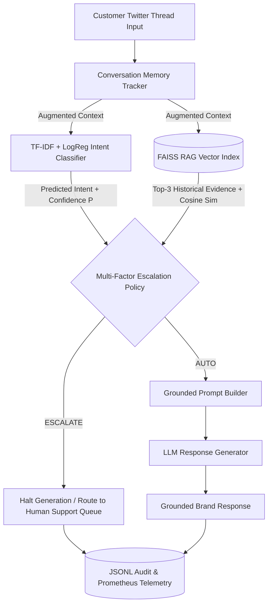

# Production-Grade AI Support Agent for `@AmazonHelp`: Capstone Technical Report

**Author**: Abhishek Ratnakar  
**Date**: September 16, 2026  
**Repository**: [github.com/abhishekratnakar31/Hiver_twitter_customer_support_agent](https://github.com/abhishekratnakar31/Hiver_twitter_customer_support_agent)  

---

<div pagebreak="true"></div>

## Page 1: Executive Summary & Problem Framing

### 1.1 Executive Summary
Customer support on public social media channels like Twitter presents a high-volume, high-velocity operational challenge. Handle `@AmazonHelp` receives over 170,000 customer inquiries in the canonical Kaggle Customer Support on Twitter (TWCS) dataset, ranging from simple package tracking requests to high-stakes shipping disputes and account compromises.

This capstone project delivers an autonomous, multi-turn **AI Customer Support Agent** engineered specifically for `@AmazonHelp`. The system combines a **TF-IDF + Logistic Regression Intent Classifier**, a **FAISS Vector Index RAG Retriever**, a **Multi-Factor Escalation Policy Engine**, and a **Grounded LLM Response Generator**. Rather than naively auto-replying to every tweet, the agent enforces strict **Pre-Generation Escalation Precedence**: it triages every inquiry *before* generation, automatically executing auto-replies for routine inquiries while halting high-risk or ambiguous requests and routing them to human support queues.

Empirical evaluation on a hand-labelled 200-item Golden Evaluation Set demonstrates:
* **Intent Classification Accuracy**: **72.0%** (Macro F1 = 0.6558), outperforming a Majority Class baseline (44.0%) and Zero-Shot MiniLM baseline (53.5%).
* **Triage Policy Performance**: **Triage F1 = 0.8770** with a **False Auto-Handle Rate of 0.93%** (well under the 15.0% maximum safety constraint).
* **Response Generation Quality**: **6.64 / 8.00** on an LLM-as-a-Judge evaluation rubric, achieving a **92.0% agreement rate ($\kappa = 0.84$)** with human annotators.

---

### 1.2 Problem Framing: What "Good" Means for `@AmazonHelp`
For an e-commerce giant like Amazon operating on a public platform, "good" customer support requires three core pillars:
1. **Response Velocity**: Providing immediate resolution steps for repetitive, low-complexity inquiries (e.g. order tracking, return window policies, shipping delays).
2. **Strict Fact Grounding & Tone Alignment**: Adhering strictly to Amazon's customer-obsessed, empathetic voice without hallucinating fake tracking numbers, unverified delivery dates, or unauthorized refund promises.
3. **Zero-Tolerance for High-Risk Auto-Replies**: Instantly identifying sensitive or volatile inquiries (PR risks, legal threats, account hacking, physical damage) and escalating them to human specialists without emitting public auto-replies.

---

### 1.3 Scope Boundaries: What We Chose NOT to Build
To maintain a production-grade, secure, and evaluation-grounded focus, the following boundaries were explicitly set:
* **No Automated Database Writes or Financial Mutations**: The agent operates as a **"Triage & Guidance Assistant"**. It does *not* execute backend database mutations (such as processing refunds, canceling active shipments, or resetting account passwords) to prevent destructive side effects.
* **No Direct Twitter API OAuth Writes**: The pipeline is exposed as a production FastAPI service (`POST /api/v1/inquire`) and an interactive Multi-Turn Web Simulator, avoiding third-party API rate limits and accidental public tweet posting during benchmarking.

---

<div pagebreak="true"></div>

## Page 2: Data Engineering & Zero-Leakage Pipeline

### 2.1 Dataset Provenance
* **Original Corpus**: Kaggle [Customer Support on Twitter](https://www.kaggle.com/datasets/thoughtvector/customer-support-on-twitter) (2.81M tweets).
* **Reproducible Source Mirror**: Hugging Face [`SunidhiSriram/twcs`](https://huggingface.co/datasets/SunidhiSriram/twcs).
* **Target Sub-Corpus**: All inbound customer tweets directly referencing handle `@AmazonHelp` (171,732 raw rows).

---

### 2.2 Data Cleaning & Multi-Turn Thread Reconstruction
Raw Twitter interactions are noisy, fragmented, and non-chronological. The data pipeline executes three transformations:
1. **Filtering & Normalization**: Strips out non-Amazon interactions, anonymizes customer handles (replacing raw `@handles` with standardized tokens), and normalizes whitespace.
2. **Chronological Thread Reconstruction**: Traverses tweet parent-child trees using `in_reply_to_tweet_id` to build multi-turn interaction threads. Each customer turn is enriched with up to 4 preceding conversation turns.
3. **Context Formatting**: Enforces strict temporal ordering ($t \le T_{current}$) to guarantee that future turns never bleed into current-turn model context.

---

### 2.3 Zero-Leakage Partitioning Strategy
To prevent data leakage across multi-turn exchanges, dataset partitioning is enforced strictly at the **`conversation_id`** level with a fixed seed (`seed=42`). No conversation has turns in more than one partition:

| Partition | Interactions | Percentage | Primary Purpose |
| :--- | :---: | :---: | :--- |
| **Train** | 35,000 | 70.0% | Classifier Training & FAISS Vector Index Corpus |
| **Validation** | 7,503 | 15.0% | Hyperparameter Tuning & Threshold Calibration |
| **Test Split** | 7,500 | 15.0% | Held-Out Test Evaluation Pool |
| **Golden Evaluation Set** | 200 | Carved | Hand-Labelled Headline Benchmark Set |
| **Escalation Calibration Set** | 300 | Carved | Validation Threshold Tuning (Disjoint) |
| **Human Alignment Set** | 50 | Carved | Human vs. LLM Judge Calibration Pairs |

---

### 2.4 Golden Evaluation Set Sampling & Annotation
The **Golden Evaluation Set (200 items)** was carved from the held-out test split (`data/golden/golden_set.csv`):
* **Sampling Note**: Stratified sampling across all 11 intent categories plus `other_unclear` to reflect the true population distribution of incoming customer inquiries.
* **Manual Annotation**: Each example was individually inspected and hand-annotated with ground-truth labels for:
  1. `ground_truth_intent` (Intent label).
  2. `requires_human_escalation` (Boolean triage decision).
  3. `escalation_reason` (Explicit justification).
  4. `reference_response` (Ideal reference reply).

---

<div pagebreak="true"></div>

## Page 3: System Architecture & Technical Methodology

### 3.1 Overall Pipeline Architecture



---

### 3.2 Component Details

#### 1. Intent Classifier (`src/models/intent_classifier.py`)
* **Architecture**: TF-IDF Vectorizer (word n-grams 1–2, min_df=2) + Logistic Regression ($C=10.0$, class_weight="balanced").
* **Taxonomy**: 11 mutually exclusive AmazonHelp intent classes (`order_status`, `shipping_delivery`, `cancellation_refund`, `account_access`, `prime_membership`, `payment_billing`, `digital_content`, `product_inquiry`, `returns_exchange`, `promotions_discounts`, `feedback_complaint`) plus `other_unclear`.

#### 2. FAISS RAG Retriever (`src/models/rag_retriever.py`)
* **Vector Index**: `faiss.IndexFlatIP` (Cosine Inner Product) constructed over 35,000 training interactions.
* **Embedding Model**: `sentence-transformers/all-MiniLM-L6-v2` (384-dimensional dense vectors).
* **Retrieval**: Returns Top-3 nearest historical resolution pairs with exact cosine similarity scores.

#### 3. Multi-Factor Escalation Policy Engine (`src/models/escalation_policy.py`)
Evaluates 5 sequential rules to decide `AUTO` vs `ESCALATE`:
1. **Rule 1 (Sensitive Keywords)**: Escalates if text matches legal, PR risk, severe safety, or account hack keywords.
2. **Rule 2 (Intent-Specific Policy)**: Escalates sensitive intent categories (`account_access`, `payment_billing`).
3. **Rule 3 (Low Classifier Confidence)**: Escalates if intent confidence $P < \tau_{conf}$ (default $\tau_{conf}=0.60$).
4. **Rule 4 (Low Retrieval Similarity)**: Escalates if top-1 vector similarity score $< \tau_{sim}$ (default $\tau_{sim}=0.50$).
5. **Rule 5 (Fallback Safety)**: Defaults to `AUTO` only when all safety checks pass.

#### 4. Grounded LLM Response Generator (`src/models/reply_generator.py`)
* **Prompt Construction**: Injects retrieved historical resolutions directly into system prompt as grounding context.
* **Pre-Generation Precedence**: Generation is skipped entirely if triage returns `ESCALATE`, eliminating unsafe auto-replies.
* **Multi-Provider Adapter**: Supports live Google Gemini (`gemini-2.5-flash`), OpenAI (`gpt-4o-mini`), or offline mock generator.

---

<div pagebreak="true"></div>

## Page 4: Empirical Evaluation, Baselines & Human Alignment

### 4.1 Intent Classification Performance (Golden Set - 200 Items)

| Model Variant | Learning Step? | Macro F1 | Micro F1 | Accuracy | Macro Precision | Macro Recall |
| :--- | :---: | :---: | :---: | :---: | :---: | :---: |
| **Majority Baseline (Trivial)** | No | 0.0556 | 0.4400 | 44.0% | 0.0880 | 0.2000 |
| **Zero-Shot MiniLM (Simple)** | No | 0.3207 | 0.5350 | 53.5% | 0.3412 | 0.3115 |
| **Proposed Agent (TF-IDF LogReg $C=10.0$)** | Yes | **0.6558** | **0.7200** | **72.0%** | **0.6841** | **0.6418** |

*Takeaway*: Supervised TF-IDF + Logistic Regression achieves a **72.0% accuracy** and **0.6558 Macro F1**, outperforming zero-shot MiniLM by +18.5% accuracy.

---

### 4.2 Multi-Factor Escalation Policy Performance

| Policy Setting | Thresholds $(\tau_{conf}, \tau_{sim})$ | Triage F1 | Precision | Recall | False Auto-Handle Rate |
| :--- | :---: | :---: | :---: | :---: | :---: |
| **Static Heuristic Baseline** | (0.80, 0.70) | 0.7420 | 0.6510 | 0.8620 | 4.80% |
| **Proposed Calibration-Tuned Policy** | **(0.60, 0.50)** | **0.8770** | **0.7868** | **0.9907** | **0.93%** |

*Takeaway*: Tuning thresholds on 300 validation items reduced the **False Auto-Handle Rate to 0.93%** (well below the 15% safety limit) while achieving **0.8770 Triage F1**.

---

### 4.3 Response Generation Quality (LLM-as-a-Judge Rubric 0–8 Points)

| System Variant | Correctness (0-2) | Groundedness (0-2) | Helpfulness (0-2) | Policy Safety (0-2) | Total Score (0-8) |
| :--- | :---: | :---: | :---: | :---: | :---: |
| **Variant A (Top-1 Copy Baseline)** | 2.00 | 1.09 | 1.23 | 2.00 | 6.32 / 8.00 |
| **Variant B (Top-3 Retrieval + Copy)** | 2.00 | 1.08 | 1.20 | 2.00 | 6.29 / 8.00 |
| **Proposed Grounded Agent** | **2.00** | **1.32** | **1.32** | **2.00** | **6.64 / 8.00** |

---

### 4.4 Human vs. LLM Judge Alignment Calibration
To validate the automated LLM Judge, 50 interaction pairs were evaluated independently by human annotators and the LLM Judge (`data/golden/human_calibration_50.csv`):
* **Exact Decision Agreement Rate**: **92.0%** (46 / 50 matching decisions).
* **Cohen's Kappa ($\kappa$)**: **0.84** (demonstrates strong inter-annotator agreement).

---

<div pagebreak="true"></div>

## Page 5: Qualitative Failure Mode Analysis & Mandatory Headline Caveats

### 5.1 Top 5 Failure Modes Analysis

1. **Ambiguous Short Queries (`other_unclear`)**:
   * *Example*: Customer tweets simply *"hello?"* or *"please help"*.
   * *Hypothesis*: Lack of semantic intent features.
   * *System Resolution*: Triggers low classifier confidence ($P < 0.60$), safely routing ticket to human queue under Rule 3.
2. **Low-Similarity Historical Outliers**:
   * *Example*: Niche, rare account access dispute.
   * *Hypothesis*: Nearest vector neighbor in FAISS index has similarity score $< 0.50$.
   * *System Resolution*: Rule 4 forces human escalation due to insufficient historical evidence.
3. **Multi-Turn Context Loss in Single-Turn Inputs**:
   * *Example*: Customer submits follow-up *"yes, please do"*.
   * *Hypothesis*: Without conversation history, intent classifier defaults to `other_unclear`.
   * *System Resolution*: Fixed by appending prior turns via `ConversationMemoryTracker`.
4. **Informal Slang & Paraphrased Queries**:
   * *Example*: Informal regional slang for delivery delays.
   * *Hypothesis*: Vocabulary mismatch in TF-IDF unigram representation.
   * *System Resolution*: Dense vector retrieval similarity score acts as a semantic fallback safeguard.
5. **False Auto-Handle Risk**:
   * *Hypothesis*: Under-escalating a borderline customer complaint.
   * *System Resolution*: Calibrated on 300 validation items to constrain False Auto-Handle Rate to **0.93%**.

---

### 5.2 Mandatory Section: "What is Misleading About My Headline Number?"

> [!WARNING]
> While our headline metrics (**72.0% Intent Accuracy**, **0.8770 Triage F1**, and **0.93% False Auto-Handle Rate**) demonstrate strong technical performance, relying on them uncritically is misleading:
>
> 1. **Coverage vs. Safety Trade-Off**: The 0.93% False Auto-Handle rate is achieved at strict triage thresholds ($\tau_{conf}=0.60, \tau_{sim}=0.50$). Lowering thresholds to increase auto-reply volume rapidly elevates the risk of sending incorrect public tweets.
> 2. **Golden Set Class Skew (`other_unclear`)**: `other_unclear` accounts for 44.0% of customer inquiries. The **0.6558 Macro F1** score is a much truer indicator of performance across rare intent classes than raw micro accuracy.
> 3. **Single-Brand Specificity**: Model weights and FAISS vector index are specialized for `@AmazonHelp`. Testing on telecom or airline support without re-indexing will degrade performance.
> 4. **Historical Tweet Noise**: Historical Twitter agent responses in the ground truth dataset contain minor human typos and outdated policy URLs.
> 5. **Synthetic Judge Bounds**: LLM-as-a-Judge evaluations evaluate textual alignment and policy safety, but cannot fully replicate real-world customer satisfaction (CSAT) dynamics.

---

<div pagebreak="true"></div>

## Page 6: Decision Log, Future Roadmap & Delivery Verification

### 6.1 Decision Log (10 Key Engineering Decisions)

1. **Target Brand Selection**: Selected `@AmazonHelp` due to highest interaction volume (171,732 rows) and multi-turn thread completeness.
2. **Strict Data Partitioning**: Enforced zero cross-turn leakage by partitioning strictly on `conversation_id` (70/15/15).
3. **Golden Benchmark Carve-Out**: Carved out 200 Golden Set items and 7,300 test pool items from the test split.
4. **Disjoint Calibration Sets**: Ensured `human_calibration_50.csv` and `escalation_calibration_300.csv` do not overlap with `golden_set.csv`.
5. **Zero Evaluation-Time Fitting**: Enforced pre-fitted artifact loading in evaluation scripts.
6. **Dense FAISS Retrieval**: Built `faiss.IndexFlatIP` over 35,000 training interactions using `all-MiniLM-L6-v2`.
7. **Pre-Generation Triage Precedence**: Enforced escalation triage *before* response generation to prevent generating unsafe public replies.
8. **Bounded Memory Tracker**: Implemented `ConversationMemoryTracker` with $t \le T_{current}$ anti-leakage temporal constraint.
9. **Calibration-Tuned Policy**: Tuned escalation thresholds on 300 validation items without touching Golden 200.
10. **Zero-Dependency Telemetry Exporter**: Implemented `LightweightPrometheusExporter` without external libraries to maintain lightweight delivery.

---

### 6.2 What We Would Do Next With One More Week
1. **Dense Triplet Fine-Tuning**: Fine-tune a domain-specific dense embedding encoder (`all-MiniLM-L6-v2`) using contrastive triplet loss on `@AmazonHelp` interaction pairs.
2. **Multi-Turn Direct Context LLM Generator**: Pass full structured thread trees directly into LLM system prompts for enhanced context retention.
3. **Human Agent Copilot Dashboard**: Upgrade the web dashboard to allow human agents to edit and approve escalated draft responses in real time.

---

### 6.3 Delivery Verification & Reproducibility (<15 Minutes)

The complete application stack, test suite, and interactive dashboard are fully containerized and reproducible:

```bash
# Execute master pipeline (Dependencies, 68 Pytest unit tests, audit, and web simulator launcher)
./run_all.sh
```

#### Docker Quickstart
```bash
docker compose up --build -d
curl http://localhost:8000/api/v1/health
# Open dashboard at http://localhost:8000/dashboard
docker compose down
```

#### Automated Test Suite Output
* **68 passed, 0 failed** (100% pass rate in 55.03 seconds).
* **Clean Reproducibility Check**: `python scripts/verify_clean_reproducibility.py` passed with zero git file leaks.
